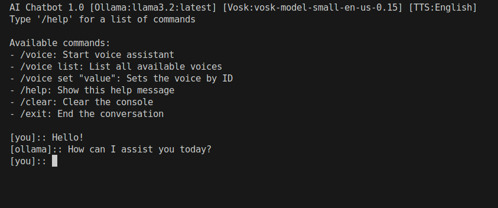

# AI Chatbot - Text&Voice [Ollama+Vosk]

This is a console-based chatbot application that leverages machine learning models for natural language processing. It supports voice commands, text-to-speech, and syntax highlighting for programming languages.

## Screenshots


## Features

- **Voice Assistant**: Record audio and transcribe it to text for conversation.
- **Model Interaction**: Generate responses from a machine learning model based on conversation history.
- **Syntax Highlighting**: Display programming code with syntax highlighting for better readability.
- **Text-to-Speech**: Convert text responses into speech for an interactive experience.
- **Command History**: Keep track of user input across sessions.

## Requirements

To run this application, you'll need to install Ollama and the following Python packages into your environment:

- `sounddevice`
- `numpy`
- `requests`
- `pyttsx3`
- `vosk`
- `pygments`
- `colorama`

You can install the required packages using `pip`:
```bash
pip install sounddevice numpy requests pyttsx3 vosk pygments colorama
```

Or using the `requirements.txt` file

## Configuration

1. **Config file**
Before running the application, you'll need to modify or create a `config.json` file to store your configuration settings. Here's a sample structure:

```json
{
    "APP": {
        "name": "AI Chatbot",
        "version": 1.0
    },
    "OLLAMA": {
        "model_name": "llama3.2:latest",
        "temperature": 0.5,
        "seed": 42,
        "typing_delay": 0.007,
        "address": "http://localhost:11434/api/chat",
        "context-initialization": [
            {
                "role": "user",
                "content": "Always answer very short, but act like a professional. Start over."
            },
            {
                "role": "assistant",
                "content": "Alright"
            }
        ]
    },
    "VOSK": {
        "path": "models/vosk/",
        "model_name": "vosk-model-small-en-us-0.15"
    },
    "AUDIO_RECORDER": {
        "threshold": 0.05,
        "silence_duration": 1.5,
        "samplerate": 44100
    },
    "VOICE": {
        "id": "English",
        "rate": 125,
        "volume": 1.0
    }
}
```

**OLLAMA**
- **model_name**: Specify the model you want to use. Ensure the model is available. (e.g., `"model_name": "llama3.2:latest"`)
- **temperature**: Adjust this value to control the randomness of responses. (0.0 = deterministic, 1.0 = highly random)
- **seed**: Change this to set the random seed for reproducibility.
- **typing_delay**: Modify this value to adjust the delay in typing simulation.
- **address**: Update the API address if your server runs on a different port or IP. (e.g., `"address": "http://127.0.0.1:8000/api/chat"`)
- **context-initialization**: Customize the initial messages to set the assistant’s behavior and tone.

**VOSK**
- **path**: Ensure this path points to your VOSK model directory. (e.g., `"path": "models/vosk/"`)
- **model_name**: Use the name of the VOSK model you want to load. (keep in mind that it should be the folder name inside vosk folder)

**AUDIO_RECORDER**
- **threshold**: Adjust this value to change the sensitivity of audio detection.
- **silence_duration**: Set the duration (in seconds) for silence detection.
- **samplerate**: Change the sample rate for audio recording as required.

**VOICE**
- **id**: Specify the voice language/identifier. (e.g., `"id": "Spanish"`)
- **rate**: Adjust the speech rate (words per minute).
- **volume**: Change the volume level (0.0 to 1.0).

### Models
Before running the application, you will also need to download the models for Ollama and Vosk.
For Ollama you can just push into the console `ollama pull llama3.2` and for Vosk you need to go their website.
Remember to set the `path` for Vosk in the `config.json` file. 

## Usage

1. **Run the Application**: Execute the Python script to start the chatbot console.

   ```bash
   python main.py
   ```

2. **Commands**:
   - `/voice`: Start the voice assistant to record audio input.
   - `/voice list`: List all available voices.
   - `/voice set "value"`: Set the voice by ID.
   - `/help`: Display available commands.
   - `/clear`: Clear the console.
   - `/exit`: End the conversation.

3. **Conversation**: Type your messages into the console to engage in conversation with the chatbot. The chatbot will generate responses based on your input.

## Project Structure

- **main.py**: The main script that runs the chatbot.
- **config.json**: Configuration file for application settings.
- **audio_recorder.py**: Handles audio recording and transcribing.
- **transcriber.py**: Manages audio transcription using Vosk.
- **text_to_speech.py**: Converts text to speech using pyttsx3.
- **spinner.py**: Displays a loading spinner during processing.
- **syntax_highlighter.py**: Provides syntax highlighting for programming languages.

## Dependencies

The application uses several external libraries as mention above:

- **Audio Recorder**: Utilizes `sounddevice` and `numpy` for audio capture and processing.
- **Spinner**: Implements a loading spinner with `itertools` and `threading`.
- **Syntax Highlighter**: Uses `pygments` for syntax highlighting in various programming languages.
- **Text to Speech**: Integrates `pyttsx3` for text-to-speech functionality.
- **Transcriber**: Leverages `vosk` for real-time speech recognition.

## License

This project is licensed under the MIT License - see the [LICENSE](LICENSE.md) file for details.

**External Licenses:**
- [Ollama](https://github.com/ollama/ollama/blob/main/LICENSE)
- [Vosk](https://alphacephei.com/vosk/)
